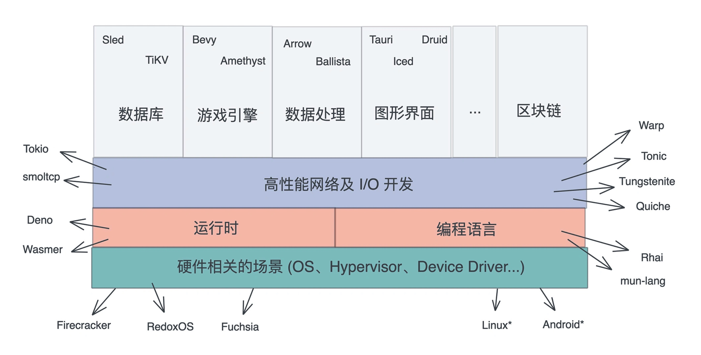

* 笔记时间：2021-11-05
* 作者：humyna

## 1. 众所周知的优异性能和强大的表现力，让 Rust 在很多场合都能够施展拳脚

截止 2021 年，主流的互联网公司都把 Rust 纳入主力语言，比如开发操作系统 Redox/Fuchsia、高性能网络 Tokio、应用的高并发后端 TiKV，甚至客户端软件本身（飞书）。 Rust 除了在其传统的系统开发领域，如操作系统、设备驱动、嵌入式等方向高歌猛进之外，还在服务端高性能、高并发场景遍地开花。

)

Go for the code that has to ship tomorrow, Rust for the code that has to keep running for the next five years.

## 2. 越来越多的企业拥抱 Rust
最近两年，几乎每隔一段时间我们就能听到很多知名互联网企业用 Rust 重构其技术栈的消息。比如 Dropbox 用 Rust 重写文件同步引擎、Discord 用 Rust 重写其状态服务。其实，这些公司都是业务层面驱动自然使用到 Rust 的。
```
亚马逊：用 Rust 构建工具；

Facebook：源代码控制工具；

Google：作为 Fuchsia 项目的一部分；

微软：在新的 Azure 物联网框架中部分使用 Rust；

Twitter：用 Rust 作为构建团队支持的一部分。

国内的百度、阿里，也已经在内部小范围的使用上了 Rust。相信，随着更多公司对 Rust 的选择，Rust 的成长速度将更加迅猛。
```

比如 Discord 原先使用 Golang 的状态服务，一来会消耗大量的内存，二来在高峰期时不时会因为垃圾回收导致巨大的延迟，痛定思痛后，他们选用 Rust 重写。按照 Discord 的官方说法，Rust 除了带来性能上的提升外，还让随着产品迭代进行的代码重构变得举重若轻。

```
Along with performance, Rust has many advantages for an engineering team. For example, its type safety and borrow checker make it very easy to refactor code as product requirements change or new learnings about the language are discovered. Also, the ecosystem and tooling are excellent and have a significant amount of momentum behind them.
```

从 16 年起，连续六年成为 [Stack Overflow 用户评选出来的最受喜爱的语言](https://stackoverflow.blog/2021/03/15/getting-started-with-rust/)。


### 参考资料
* https://time.geekbang.org/column/article/408400?code=4Zo%252FPv7FlOuClwXjV3AXzoRotXdEld%252FSVBmvwDouEzM%253D
* https://mp.weixin.qq.com/s/DjQlyQeushrXM7QNxbY-cA
