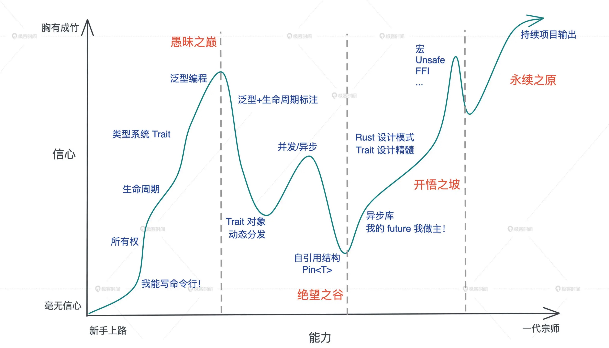
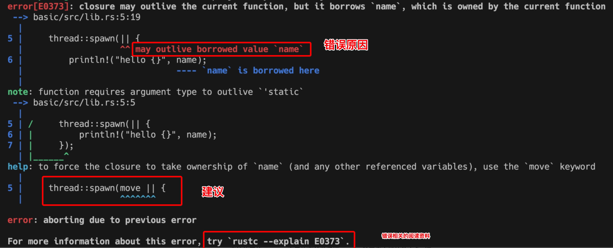

* 笔记时间：2021-11-05
* 作者：humyna

## Rust 学习曲线很陡峭

Rust 被公认是很难学的语言，学习曲线很陡峭。

如果你想从其他语言迁移到 Rust，必须要经过一段时期的思维转换（Paradigm Shift）。

从命令式（imperative）编程语言转换到函数式（functional）编程语言、从变量的可变性（mutable）迁移到不可变性（immutable）、从弱类型语言迁移到强类型语言，以及从手工或者自动内存管理到通过生命周期来管理内存，难度是多重叠加。

而 Rust 中最大的思维转换就是变量的所有权和生命周期，这是几乎所有编程语言都未曾涉及的领域。

学习过程中，在所有权和生命周期之外，语言背景不同的工程师也会有不同难点，你可以重点学习：
* C 开发者，难点是类型系统和泛型编程；
* C++ 开发者，难点主要在类型系统；
* Python/Ruby/JavaScript 开发者，难点在并发处理，类型系统及泛型编程；
* Java 开发者，难点在异步处理和并发安全的理解上；
* Swift 开发者，几乎没有额外的难点，深入理解 Rust 异步处理即可。

只要迈过这段艰难的思维转换期，你就会明白，Rust 确实是一门从内到外透着迷人光芒的语言。

从语言的内核来看，它重塑了我们对一些基本概念的理解。比如 Rust 清晰地定义了变量在一个作用域下的生命周期，让开发者在摒弃垃圾回收（GC）这样的内存和性能杀手的前提下，还能够无需关心手动内存管理，让内存安全和高性能二者兼得。

从语言的外观来看，它使用起来感觉很像 Python/TypeScript 这样的高级语言，表达能力一流，但性能丝毫不输于 C/C++，从而让表达力和高性能二者兼得。

##  Rust 是一门非常重视开发者用户体验的语言

Rust编译器会在告知你的代码错误的同时，还会极尽可能，给你推荐正确的代码。

当然Rust 语言的这种极致用户体验不仅仅反映在编译器上，整个语言的工具链包括 rustup、cargo 等，都是如此简单易用、善解人意。

### 参考资料
* https://time.geekbang.org/column/article/408400?code=4Zo%252FPv7FlOuClwXjV3AXzoRotXdEld%252FSVBmvwDouEzM%253D
