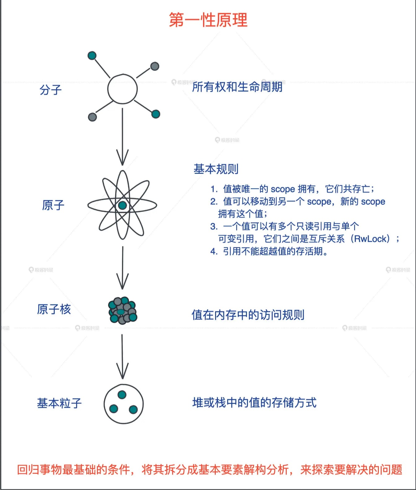
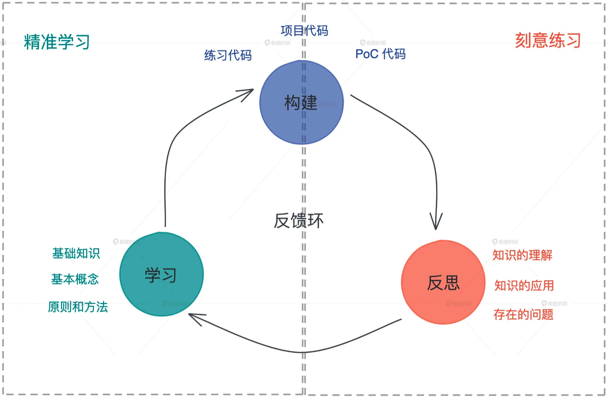

* 笔记时间：2021-11-06
* 作者：humyna

```
任何语言的学习离不开精准学习 + 刻意练习。这是一套被证明非常有效的从入门到进阶学习编程语言的方法！
```

## 学习思路

学了没有学会绝不罢休，不断在学习 - 构建 - 反思这个循环中提升自己。


## 精准学习

所谓精准学习，就是深挖一个个高大上的表层知识点，回归底层基础知识的本原，再使用类比、联想等方法，打通涉及的基础知识；然后从底层设计往表层实现，一层层构建知识体系，这样“撒一层土，夯实，再撒一层”，让你对知识点理解得更透彻、掌握得牢固。

比如 Rust 中的所有权和生命周期，很多同学看书或者看其他资料这部分仍学得云里雾里的，即便深入逐一理解了几条基本规则，也依旧似懂非懂。

但我们进一步思考“值在内存中的访问规则”，最后回归到堆和栈这些最基础的软件开发的概念，重新认识堆栈上的值的存储方式和生命周期之后，再一层层往上，我们就会越学越明白。

这就是回归本原的重要性，也就是常说的第一性原理：回归事物最基础的条件，将其拆分成基本要素解构分析，来探索要解决的问题。



## 刻意学习

精准学习之后，我们就需要刻意练习了。刻意练习，就是用精巧设计的例子，通过练习进一步巩固学到的知识，并且在这个过程中尝试发现学习过程中的不自知问题，让自己从“我不知道我不知道”走向“我知道我不知道”，最终能够在下一个循环中弥补知识的漏洞。

我们学习就要这样，学了没有学会绝不罢休，不断在学习 - 构建 - 反思这个循环中提升自己。Rust 的学习，也是如此。



### 参考资料
* https://time.geekbang.org/column/article/408400?code=4Zo%252FPv7FlOuClwXjV3AXzoRotXdEld%252FSVBmvwDouEzM%253D
